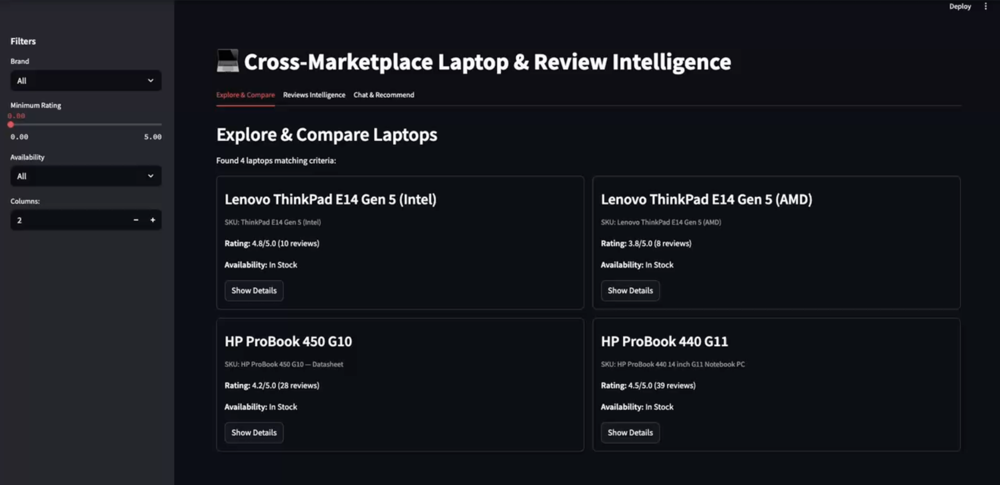

#  Cross-Marketplace Laptop & Review Intelligence Engine

This project builds an **insights engine** for specific business laptops sold on Lenovo and HP first-party stores, fulfilling the requirements of the _“Cross-Marketplace Laptop & Review Intelligence”_ assignment.  
It leverages **Retrieval-Augmented Generation (RAG)** to combine canonical technical specifications from PDFs with mutable data (like price and reviews)  from brand websites, providing an interactive analytics experience and a chatbot interface.





---

##  Problem Statement

The goal is to create a system that can answer natural language questions, provide purchase recommendations with citations, and offer analytical insights about four specific business laptops:

- Lenovo ThinkPad E14 Gen 5 (Intel)
- Lenovo ThinkPad E14 Gen 5 (AMD)
- HP ProBook 450 G10
- HP ProBook 440 G11

The system must treat official PDF spec sheets as **ground truth** for technical details and brand product pages as the **source for dynamic information** like price, availability, and reviews.

---

##  Features

- **Coherent Dataset:** Integrates static technical specs with dynamic market data (prices, reviews, availability, etc.).  
- **RAG Chatbot:** Answers natural language questions about laptop specs, prices, availability, and comparisons using **Google Gemini**, providing citations from source PDFs. Supports chat history (last 5 messages).  
- **Laptop Recommender:** Suggests suitable laptop models based on user constraints (budget, specs, availability) provided via the chat interface, with rationales and citations.  
- **Interactive Exploration & Comparison:** A **Streamlit UI** allows users to browse the laptop catalog, apply filters (brand, rating, availability), and view detailed information including price trends and recent reviews.  
- **Reviews Intelligence:** Visualizes review volume and rating trends over time, plus rating distributions for selected laptops.  
- **Versioned REST API:** A modular **FastAPI backend** exposes endpoints for catalog, filtering, price history, reviews, Q&A, and the RAG chat/recommendation service. Includes automatically generated documentation via `/docs`.  
- **Source Linking:** Provides links back to the original canonical PDF spec sheets.

---

##  Tech Stack

| Component | Technology |
|------------|-------------|
| **Backend** | Python · FastAPI · Uvicorn |
| **Frontend** | Streamlit |
| **LLM** | Google Gemini API (`gemini-2.5-flash` via `google-generativeai`) |
| **Vector Database/Search** | FAISS (`faiss-cpu`) |
| **Embeddings** | Sentence Transformers (`all-MiniLM-L6-v2`) |
| **Dynamic Data Storage** | SQLite |
| **Data Manipulation & Charting** | Pandas · Plotly Express |
| **API Interaction** | Requests |
| **Environment Management** | Conda |
| **Configuration** | python-dotenv |

---

##  Architecture & Design Decisions

The system employs a **Retrieval-Augmented Generation (RAG)** architecture to provide accurate, context-aware answers based on both static and dynamic data sources.

### 1️⃣ Static Data Pipeline (Technical Specifications)

**Source:** The 4 provided PDF spec sheets were treated as the immutable ground truth for technical details.

**Processing & Chunking:** Text content was extracted and manually segmented into logical chunks based on document sections (e.g., "Processor", "Memory", "Ports and Slots", "Display"). Each chunk was structured into a JSON object.

**JSON Structure:**

Each JSON object represents a semantic chunk and includes:

```json
{
  "content": "text content of the section",
  "subfeatures": ["option1", "option2"],
  "source_model": "ThinkPad E14 Gen 5 (Intel)",
  "section_title": "Processor",
  "source_citations": ["1", "2"]
}
```

These structured JSON files form the static dataset in `/data`.

**Embedding & Indexing:**

- Text from each main section and subfeature is embedded using `SentenceTransformer('all-MiniLM-L6-v2')`.
- Each embedding (384-dim) is stored in a **FAISS IndexFlatL2** (`laptops.index`) for 100% retrieval accuracy.
- Metadata (chunk, SKU, section title, citations) is stored in parallel (`laptops_metadata.json`).

---

### 2️⃣ Dynamic Data Pipeline (Market Information)

**Source:** Dynamic info (price, reviews, availability) is taken from live brand pages. For the prototype, data was manually collected or synthetically generated.

**Storage:** SQLite database (`laptops_dynamic.db`) with tables:

| Table | Description |
|--------|--------------|
| **Laptop** | Static catalog info (brand, model) + mutable snapshot (price, reviews, etc.) |
| **PriceHistory** | Price points by date/vendor |
| **Review** | User reviews (rating, text, date, source) |
| **QuestionAnswer** | Q&A excerpts |

**Linking:** The `sku` column (matching `source_model` in JSON) serves as the foreign key between static and dynamic data.

---

### 3️⃣ Backend API (FastAPI)

A modular FastAPI app (`/app` directory) handles REST endpoints and RAG logic.

#### Core files:

- `config.py`: Loads environment variables.  
- `utils.py`: Loads FAISS, metadata, LLM client, DB connections.  
- `rag_handler.py`: Implements RAG pipeline (embedding query → FAISS search → Gemini generation).  
- `main.py`: API routes.  
- `models.py`: Pydantic schemas.  

#### Workflow (rag_handler.py):

1. Embed user query using SentenceTransformer.  
2. Search FAISS for top chunks.  
3. Retrieve metadata & SKUs.  
4. Query SQLite for dynamic info.  
5. Construct RAG prompt → Send to Gemini.  
6. Return model answer + context.

---

### 4️⃣ Frontend UI (Streamlit)

- `streamlit_app.py` builds a Streamlit dashboard.  
- Fetches all data via HTTP (`requests`) from FastAPI.  
- Uses `st.session_state` for chat history.  
- Displays tables, price/review charts using `Pandas` + `Plotly Express`.

---

## 📁 Project Structure

```
/laptop-agent
|-- /backend
|   |-- /app
|   |   |-- __init__.py
|   |   |-- config.py
|   |   |-- main.py
|   |   |-- models.py
|   |   |-- rag_handler.py
|   |   `-- utils.py
|   |-- .env
|   |-- .env.example
|   |-- laptops.index
|   |-- laptops_metadata.json
|   |-- laptops_dynamic.db
|   `-- requirements.txt
|-- /data
|   `-- *.json
|-- /scripts
|   |-- build_vector_index.ipynb
|   `-- setup_dynamic_db.ipynb
|-- .gitignore
|-- README.md
|-- schema_diagram.png
`-- streamlit_app.py
```

---

## ⚙️ Setup & Run Instructions

### 🧱 Prerequisites

- Python ≥ 3.9  
- Conda  
- Git

### 1️⃣ Clone the Repository

```bash
git clone https://github.com/<your-username>/<your-repo>.git
cd <your-repo>
```

### 2️⃣ Create Conda Environment

```bash
conda create --name AgentInbox python=3.10 -y
conda activate AgentInbox
```

### 3️⃣ Install Dependencies

**Backend:**
```bash
cd backend
pip install -r requirements.txt
```

**Frontend:**
```bash
cd ..
pip install streamlit pandas plotly requests
```

### 4️⃣ Set Environment Variables

```bash
cd backend
cp .env.example .env
```

Edit `.env`:
```env
GOOGLE_API_KEY=your_actual_google_api_key_here
```

### 5️⃣ Generate Data Artifacts

**Dynamic DB:**
```bash
python scripts/setup_dynamic_db.py
# or run setup_dynamic_db.ipynb
```

**FAISS Index:**
```bash
python scripts/build_vector_index.py
# or run build_vector_index.ipynb
```

### 6️⃣ Run Backend API

```bash
cd backend
uvicorn app.main:app --reload --host 0.0.0.0 --port 8000
```

### 7️⃣ Run Frontend UI

Open new terminal:

```bash
conda activate AgentInbox
streamlit run streamlit_app.py
```

---

## 🧠 Notes

- Static specs = PDFs → JSON → FAISS  
- Dynamic data = SQLite (mutable)  
- Linking = `source_model` (JSON) ↔ `sku` (DB)  
- Gemini handles reasoning and natural-language output  
- RAG ensures factual accuracy and traceable citations  

---

## 🧾 License

MIT License — for educational and research purposes.
